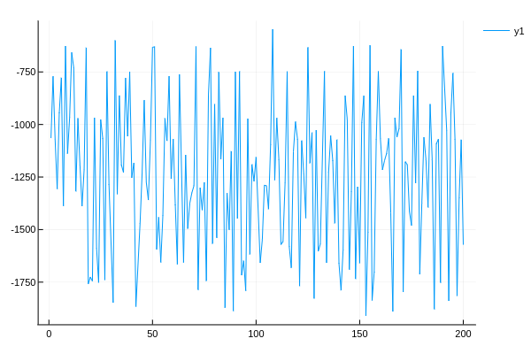

This repository contains the implementation of Soft Actor-Critic algorithm which is a Off-Policy Maximum Entropy Deep Reinforcement Learning algorithm with a Stochastic Actor.Here this baseline is integrated with OpenAIGym.jl . Below shown is the result that I have get after testing the model . I have trained and tested the model in Pendulum-v0 environment . X-axis represents number of episodes and Y-axis represents total reward . Each episode has 200 time steps .

